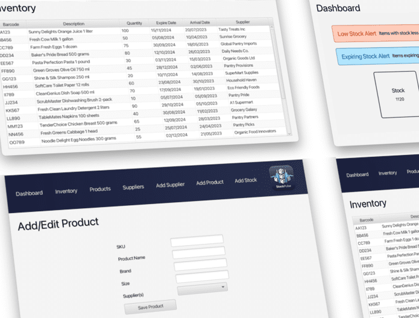

# StockPulse: Inventory Manager

## Description

This is a simple stock manager for a small business. It allows the user to add, edit and delete products from the stock.
It also allows the user to view the stock and search for products by name or by ID.

## Usage

It is a JavaFX app managed by Maven. It should run from inside your IDE.
Tested in Eclipse and IntelliJ IDEA.
